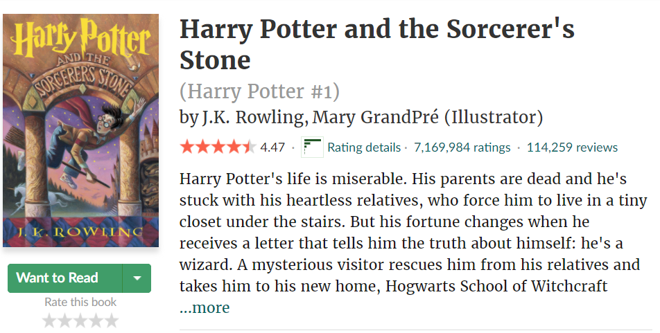

# 3380

## Introduction

The core idea of this project is to explore a different way of recommending books. While collaborative filtering and content based filtering methods have been proven to work very well (see Netflix, Amazon, etc.), I found that these suggestions are often either very shallow in terms of topic or genre - as is the case with content based filtering, where a product is suggested only because it's very similar to others - or is based entirely on what a group of people think, but often leads to unexplainable correlations.

The end goal of 3380 is to understand the subtext of a book; in other words, rather than simply look at how similar a description, genre, or author are, and rather than recommending books only because other people have read them, 3380 uses natural language processing to look at book reviews. From these, the goal is to recommend a book based on the sentiments or ideas that the text presents.

## Applications

Being able to use review texts to understand and recommend books goes well beyond the literary industry. The same system can be applied for any platform that generates reviews for products, or for any corpus with varied textual inputs.

For example, using the 3380 approach in the medical industry could allow us to create and analyze clusters of patient symptom descriptions. The approach could also be used in the aviation industry to analyze VHF radio communications and to describe patterns of pilot behaviour during different phases of flight.

## The UCSD Book Graph Dataset

All data for this project comes from the [UCSD Book Graph dataset](https://sites.google.com/eng.ucsd.edu/ucsdbookgraph/home). In its raw form it consists of over 2.3 million books and over 15 million reviews - the CSV file for the complete review dataset is over 5 GBs compressed.

This dataset was chosen in part because I wanted to find good reads, and in part because all review data was scraped from [GoodReads](https://www.goodreads.com/). Because GoodReads does not sell products directly and is built as a social media site for books I made the assumption that there would be fewer fake reviews than on a wider platform such as Amazon itself.

Due to computing limitations, the dataset was heavily filtered to reduce memory usage:

* English language books were kept, all others were removed;
* Only the highest rated edition of a book was kept;
* Books with less than 10 reviews were removed;
* Reviews with fewer than 50 characters were removed

## Some observations

One of the goals I had entering this project was to find a way to understand the quality of any particular book before investing my time and resources on it. The issue is that, on the one hand, looking at book ratings does not provide enough information, and on the other hand, parsing thousands of reviews is more time consuming than reading the book itself:

In the image we can see that Harry Potter has a star rating of just under 4.5. This indicator, however, is not particularly useful when one considers the unbalanced distribution of user ratings:

The vast majority of users will leave 4- or 5-star ratings. Additionally, it is difficult to translate a consistent rating system accross several books, since each individual user is very unlikely to rate more than a handful:

## Semantic similarity clustering

To get around the above issues, what 3380 does is employ natural language processing to find similarities between reviews. The foundation of the program is Tensorflow's Universal Sentence Encoder. What this allows us to do is to compare how similar two sentences are based not only on word choice alone, but in an attempt to approach the underlying idea of the sentence itself.

On the heatmap below we can see that the first three sentences on the y-axis are about cellphones, and each sentence is highly correlated with each other. However, the next three sentences are about weather, and the encoder correctly separates "Global Warming" from "I like my phone." However, "Global Warming" is still related to "Will it snow tomorrow?", even though the word choice is in itself not indicative of any similarity:

With this is hand, I use Sklearn's KMeans algorithm to allocate each review to a particular cluster of similar reviews. The idea is that the more dense a particular cluster area is, the more similar the reviews will be to each other.

To save on memory usage, the app only looks at the reviews for a particular book and creates semantic similarity clusters on-demand. In other words, the review clusters are loaded only when a particular book is accessed, rather than pre-training the model on all the reviews for every book. The idea behind this is that the vast majority of books are not searched for, and thus it is an unnecessary resource sink to calculate the vectors and create the clusters for every book in the dataset.

## To-Do and Miscellanea

I have not included instructions on how to run this program, nor have I provided a stable link to a live-website for it. This is because in its current state the app very quickly demands over 18 GB RAM and must have access to several GB of data. In the future I will create a small demo-version that can be hosted anywhere.

### WIP and future development:
* Small memory-use demo
* Refine similarity recommendation engine
* Update application frontend
* Include other languages
* Include real-time book updates from Goodreads

### Technologies used:

* Numpy and Pandas
    * Used for data handling, transforming, etc.
* Tensorflow Universal Sentence Encoder
    * For sentence embedding and comparison
* Langdetect
    * For data cleaning, EDA, and language filtering
* SciPy TF-IDF Vectorizer
    * For base recommendation engine and review vectorizing
* SciPy KMeans Cluster
    * For revew embedding comparison
* Streamlit
    * For frontend UI
